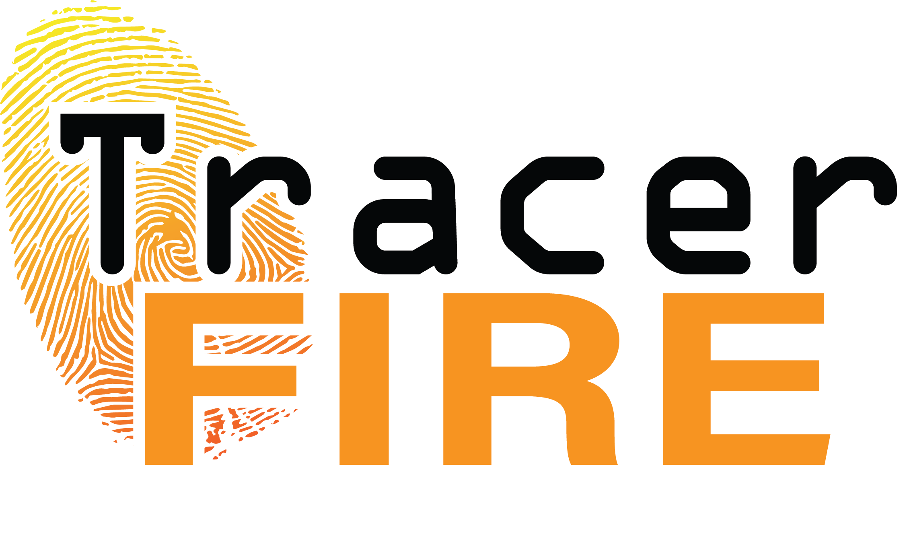

# 
Tracer FIRE (Forensic Incident Response Exercise) is a combined simulation and live exercise program developed by Sandia National Laboratories to help cyber security incident responders, analysts, and operators become proficient in critical skill areas.

## Video
https://www.youtube.com/watch?v=1ppotM9d1yA

## Available Tracer FIRE Content

* Tracer FIRE 8

