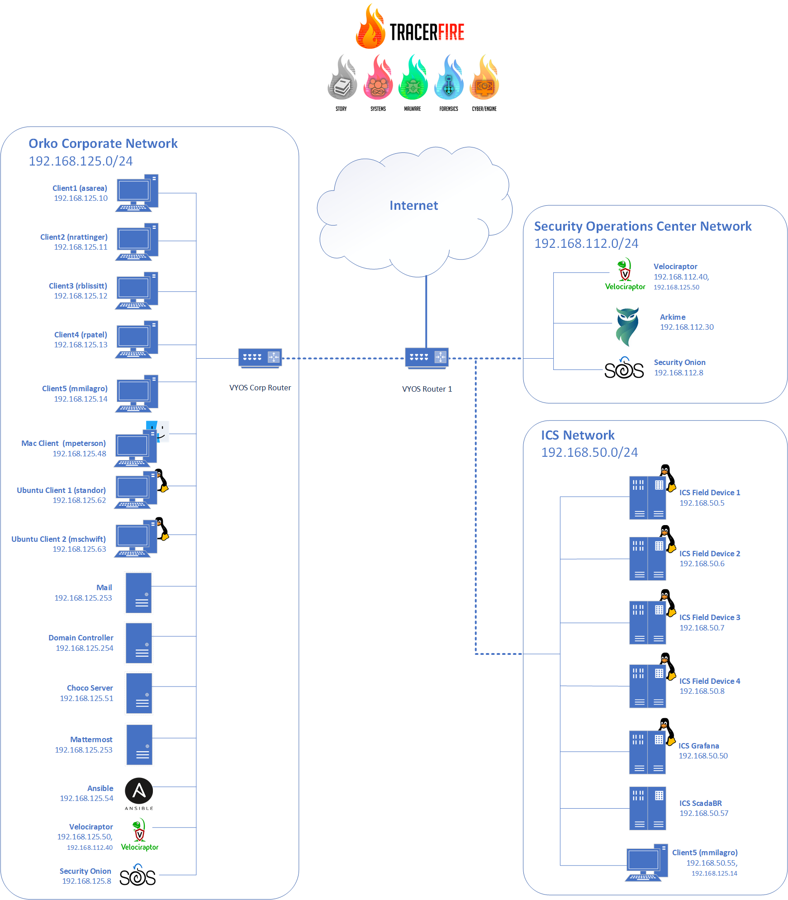

# Tracer FIRE 11

## Scenario Summary:
Over the course of a week, Orko Water Authority (O.W.A), the water service provider of Veri Xikon,
experienced multiple cyberattacks targeting their corporate and ICS infrastructure. These breaches not only jeopardized public safety but also eroded the community's trust in the organization. In response to this incident, the government of Veri Xikon has enlisted your expertise to lead a thorough investigation into the events of the week.

## Major actors in this scenario are:
  - Antton Sarea: CEO of O.W.A
  - Matt Schwift: Former CEO of O.W.A
  - Robert Blissitt: Chief Technical Officer of O.W.A
  - Mai Peterson: Chief Legal Officer of O.W.A
  - Mikey Milagro: Head of plant operations at O.W.A
  - Noah Rattinger: Exchange Engineer at O.W.A
  - Steve Tandor: Information Technologist at O.W.A
  - Karen Spade: Human Resources at O.W.A
  - Ram Patel: 3rd party developer contracted by O.W.A
  - Tracy Stone - TracerLINE News Reporter

## Description of Attack Chains:
There were 4 attacks that occured in TF11. IPs and Domains have been sanitized here, but are still present in the original logs and data. Follow proper safeguards performing forensic analysis (use a vm, disconnected from internet, etc..).
Be careful examining evidence and be sure you do not execute or connect to the original malicious content.

1. Tidal Havoc: Supply Chain Compromise into ICS (+ Mariana Trench Analysis Chain deep dive into the business layer malware on CTFD)
    - Mikey, the head of plant operations at O.W.A., experiences printing issues and reaches out to IT support — specifically Steve Tandor — for assistance. Steve instructs Mikey to install the correct driver via a Chocolatey package that has been compromised, though the team is unaware of this.
    - Mikey installs the print_driver package onto his machine, which installs and executes the businesslayer.exe executable. This file exhibits SUNBURST-like C2 traffic, communicating with an external IP address
    - Subsequently, the businesslayer.exe executable spawns a Cobalt Strike process that beacons out to an external IP address.
    - After running miscellaneous commands, the Cobalt Strike process repeatedly attempts to place and execute files on Mikey's machine, deleting each file after execution.
    - Eventually, one of these files — scvhost.exe (note the deliberate misspelling) — runs successfully and repeatedly flips the coils in the ICS system. This is possible because Mikey's client machine is connected to both the corporate and ICS networks.
    - The tampering causes water system malfunctions that are reported via Mastodon. Email records reveal that Matt Schwift arrived early to investigate the water issues.
    - Mikey arrives later to investigate as well and discovers that Matt Schwift has slipped, fallen, and died.
2. Davey Jones's Locker: Malicious Chrome Extension to Ransomware
    - Ram Patel sends Robert Blissitt an email containing an OrkoBrowserExtension.zip file along with installation instructions for the extension.
    - The Chrome extension maliciously redirects every URL the browser visits to the eco-activist domain: restorearth.land.
    - Robert Blissitt fires Ram for creating a malicious extension.
    - Robert posts on Mastodon asking for help to fix the issue. A Mastodon user called Meowstic comments and provides a "fixed" version of the extension. Robert then shares a download link of the new "fixed" Chrome extension in the O.W.A. Mattermost. This extension is even more malicious.
    - Antton Sarea sees the Mattermost post and downloads the malicious Chrome extension.
    - In the background, the Chrome extension exfiltrates Antton's `MMAUTHTOKEN` and `MMUSERID` to an external ip address.
    - Meowstic logs into Mattermost using Antton's credentials and posts as Antton Sarea, sharing a URL to the ransomware.
    - The ransomware (securityupdate.exe) executes on both Robert Blissitt's and Antton Sarea's machines.
    - Meowstic demands ransom payment.
3. Salty Sardines: Vulnerable Exchange Server to Stolen Documents
    - The attacker scans mail.vxnwua.net for the vulnerability CVE-2021-26855 from an external IP address. ProxyLogon is an SSRF (Server-Side Request Forgery) vulnerability in Exchange that allows an attacker to send arbitrary HTTP requests and authenticate as the Exchange server.
    - The exploit is successful, and the attacker leverages CVE-2021-27065 to create an ASPX webshell at: `Program Files\Microsoft\Exchange Server\V15\FrontEnd\HttpProxy\owa\auth\exchmshell.aspx`
    - Next, the attacker uses the open-source tool AntSword to interact with the deployed webshell.
    - The attacker executes PowerShell commands from the webshell to enable the Exchange Management Shell snap-in.
    - The attacker runs the Get-Mailbox command and exports all emails to mail.txt.
    - The attacker downloads mail.txt from the compromised Exchange server.
    - As the final step of the first stage, the attacker uploads the exfiltrated emails (mail.txt) to Mastodon.
    - In the second stage, the attacker sends phishing emails that direct recipients a copycat azure domain name.
    - Noah Rattinger clicks on the phishing email and enters his credentials on the fake login page, leaking them to the attacker.
    - The attacker impersonates Noah Rattinger using his email account and sends an email with instructions to install and run a supposedly legitimate (vulnerable) driver.
    - Mai Peterson executes the malicious driver, which actually deploys a Meterpreter shell. The threat actor then exfiltrates blackmail documents from Mai's machine.
4. Plankton Stagnation: Deserialization Attack Leads to Cryptojacking
    - An attacker performs a deserialization attack on the vulnerable water usage monitor application in the cloud by passing malicious cookies as the authtoken to the site.
    - When decoded, these cookies contain JavaScript with additional base64-encoded content that decodes to shell commands, which are then executed within the container.
    - In each cookie, one of the first few shell commands includes another base64-encoded block that is written to a file called payload.sh.
    - Each cookie contains shell commands that allow the attacker to escape the Podman container and execute the payload.sh file.
    - The first cookie installs netcat and establishes a connection to an external ip address as a connectivity check.
    - The second cookie runs reconnaissance commands and sends the output to an external ip address.
    - The third cookie temporarily disables SELinux and checks the container technology being used.
    - The fourth cookie installs a Monero cryptominer.

## Network Diagram
# 

## Types of Content:
1. **Host Logs**: These logs are viewable via elasticsearch during a Tracer FIRE event, and have been exported to the zip file here. The data includes all host logs gathered from forensic agents during the simulation (about 12GB zipped).
2. **PCAPs**: Most traffic was captured flowing in and out of the simulated environment over a one-week period. At a Tracer FIRE event these packet captures are viewable and exportable through Arkime but are provided below in raw pcap form.
3. **Kape**: [KAPE](https://www.kroll.com/en/publications/cyber/kroll-artifact-parser-extractor-kape) is a configurable triage program for forensic analysis. It was used to run colleciton on the windows hosts that you see below. The 7z files are the logs from the operating system collected by KAPE.
4. **Winlogs**: These are all the event logs gathered from the windows machines run durning the scenario.
6. **Presentation**: A scenario overview presentation is included to provide context and background for the simulation.

## Access Data:
*   Host Logs - [https://tracerfire-release.s3.amazonaws.com/TracerFIRE\_11/tf11\_host+\_logs.zip](https://tracerfire-release.s3.amazonaws.com/TracerFIRE_11/tf11_host+_logs.zip "https://tracerfire-release.s3.amazonaws.com/TracerFIRE_11/tf11_host+_logs.zip")
*   PCAP - [https://tracerfire-release.s3.amazonaws.com/TracerFIRE\_11/tf11\_pcaps.zip](https://tracerfire-release.s3.amazonaws.com/TracerFIRE_11/tf11_pcaps.zip "https://tracerfire-release.s3.amazonaws.com/TracerFIRE_11/tf11_pcaps.zip")
*  Kape:
    *   mmilagro - [https://tf11-data.s3.amazonaws.com/Liveresponse/Kape-mmilagro.7z](https://tf11-data.s3.amazonaws.com/Liveresponse/Kape-mmilagro.7z "https://tf11-data.s3.amazonaws.com/Liveresponse/Kape-mmilagro.7z")
    *   nrattinger - [https://tf11-data.s3.amazonaws.com/Liveresponse/Kape-nrattinger.7z](https://tf11-data.s3.amazonaws.com/Liveresponse/Kape-nrattinger.7z "https://tf11-data.s3.amazonaws.com/Liveresponse/Kape-nrattinger.7z")
    *   rblisset - [https://tf11-data.s3.amazonaws.com/Liveresponse/Kape-rblissitt.7z](https://tf11-data.s3.amazonaws.com/Liveresponse/Kape-rblissitt.7z "https://tf11-data.s3.amazonaws.com/Liveresponse/Kape-rblissitt.7z")
    *   rpatel - [https://tf11-data.s3.amazonaws.com/Liveresponse/Kape-rpatel.7z](https://tf11-data.s3.amazonaws.com/Liveresponse/Kape-rpatel.7z "https://tf11-data.s3.amazonaws.com/Liveresponse/Kape-rpatel.7z")
    *   mail - [https://tf11-data.s3.amazonaws.com/Liveresponse/Mail-Kape.7z](https://tf11-data.s3.amazonaws.com/Liveresponse/Mail-Kape.7z "https://tf11-data.s3.amazonaws.com/Liveresponse/Mail-Kape.7z")
*   Winlogs ([https://tf11-data.s3.amazonaws.com/](https://tf11-data.s3.amazonaws.com/ "https://tf11-data.s3.amazonaws.com/"), to see the proper URL look at the link on the left and download the evtx files that are interesting)
    *   Client 1 asarea - [https://tf11-data.s3.amazonaws.com/evtx/client1-asarea-winevt/](https://tf11-data.s3.amazonaws.com/evtx/client1-asarea-winevt/ "https://tf11-data.s3.amazonaws.com/evtx/client1-asarea-winevt/")
    *   Client 2 nrattinger - [https://tf11-data.s3.amazonaws.com/evtx/client2-nrattinger-winevt/](https://tf11-data.s3.amazonaws.com/evtx/client2-nrattinger-winevt/ "https://tf11-data.s3.amazonaws.com/evtx/client2-nrattinger-winevt/")
    *   Client 3 rblissitt - [https://tf11-data.s3.amazonaws.com/evtx/client3-rblissitt-winevt/](https://tf11-data.s3.amazonaws.com/evtx/client3-rblissitt-winevt/ "https://tf11-data.s3.amazonaws.com/evtx/client3-rblissitt-winevt/")
    *   Client 4 rpatel - [https://tf11-data.s3.amazonaws.com/evtx/client4-rpatel-winevt/](https://tf11-data.s3.amazonaws.com/evtx/client4-rpatel-winevt/ "https://tf11-data.s3.amazonaws.com/evtx/client4-rpatel-winevt/")
    *   Client 5 mmilagro - [https://tf11-data.s3.amazonaws.com/evtx/client5-mmilagro-winevt/](https://tf11-data.s3.amazonaws.com/evtx/client5-mmilagro-winevt/ "https://tf11-data.s3.amazonaws.com/evtx/client5-mmilagro-winevt/")
* Presentations: [https://tracerfire-release.s3.amazonaws.com/](https://tracerfire-release.s3.amazonaws.com/)
    * Overview: [https://tracerfire-release.s3.amazonaws.com/TF11-Presentations/TF11_Story_Overview_RA.pdf](https://tracerfire-release.s3.amazonaws.com/TF11-Presentations/TF11_Story_Overview_RA.pdf)
