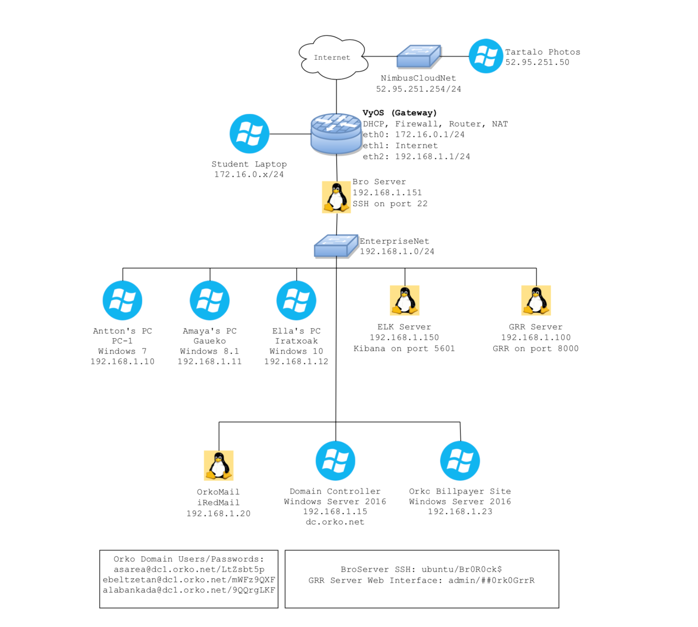

# Tracer FIRE 8

## Scenario Summary:
Orko Electric Company in Veri Xikon has been hacked. You've been hired as an incident responder to triage the incident. As you perform your forensics investigation, pay attention to what is happening with the company and the people within the company. You might find something interesting...

## Major actors in this scenario are:
* Amaya Labankada - CIO at Orko Electric Company
* Ella Beltzetan - Consultant at Orko Electric Company
* Antton Sarea - Head of IT at Orko Electric Company

## Description of Attack Chains:
There were 5 attacks that occured in TF8.
1. Erge: Spear phishing attack that pivoted and used multiple CVEs
    * Attack started through a phishing email.
    * Amaya opened the zip attachment on client 2, extracted it and opened it.
    * This rtf document exploited CVE-2017-11882 using the code from source_code/1spearfish/cve-2017-11882.
    * Original POC at https://github.com/embedi/CVE-2017-11882.
    * This document then executed code compiled from source_code/1spearfish/eternal_blue which allowed it to scan for vulnerable machines in the network and pivot to client 1.
    * Original POC at https://github.com/worawit/MS17-010.
    * Additional malware was then installed on client 1 that communicated with a C2 and exfiltrated documents.
    * The additional malware was compiled
    * This malware was influenced by https://www.welivesecurity.com/wp-content/uploads/2017/06/Win32_Industroyer.pdf.
2. Lamia: Malicious Chrome extension
    * Attack started through an email where Amaya’s significant other asked her to install a chrome extension on her computer (client 2).
    * The chrome extension was malicious and exfiltrated data from here computer.
3. Herensuge: Ransomware
    * Email forwarded to Ella from Amaya that contained a VBscript that “needed to be run for updates”
    * Ella ran the VBscript on client 3. The VBscript proceeded to unpack itself into a powershell script and then into an executable that was compiled using pyinstaller.
    * The malware then encrypted most files on her computer and changed the background to an image that requested monero to be sent to a specific address.
4. Tartalo: Data exfiltration using benign website
    * Attack started with a customer sending an invoice pdf via email to Amaya on client 2.
    * The pdf contained a link that when clicked downloaded a malicious jar file (java executable).
    * This executable ran and crawled tartalophotos.com (a custom website we created) to look for an image that contained metadata on where to exfiltrate data to.
    * Once the exfiltration location was found the malware created a copy of the user’s home directory and sent it.
5. Odei: Web Attacks on a vulnerable website
    * Vulnerable Bill Pay Web Application for the fictional power company
    * Exposes fake Personally Identifiable Information to an attacker that used basic hacking tools to get the data (metasploit, a web browser, and small python script)
    * Source code for the website can be found at source_code/TF8-BillPayApp

## Network Diagram
# 

## Types of Content:
1. Disk: The virtual hard disks of the clients in the simulation related to the attacks. You can open these images with autopsy and analyze the respective clients filesystem.
    * Client 1: Windows 7 (Antton Sarea)
    * Client 2: Windows 8.1 (Amaya Labankada)
    * Client 3: Windows 10 (Ella Beltzetan)
2. Memory: Captured memory images from clients at key points during the simulation. These memory images can be analyzed with volatility.
3. Pcaps: All captured network traffic going in and out of the simulated environment over a 2 week period.
4. Email files (smtp): A iredmail server was hosted for the purpose of creating email artifacts. The email files have all been pulled from the server.
5. TF8 Jupyter Notebooks: These notebooks act as a guide to solving the challenges created for TF8.
6. Tracer FIRE CTFd: This is an export of the questions created to guide students through understanding how the attacks happened.
    * Challenges located in db/challenges.json
    * Answers located in db/flags.json
    * Uploaded files located in uploads/*

## Access Data:
- [Hashes](https://tracerfire-release.s3.amazonaws.com/TracerFIRE-8/hashes+(SAND2020-5637+O).txt)
- [TF8 Disk](https://tracerfire-release.s3.amazonaws.com/TracerFIRE-8/TF8-disk-SAND2020-5637_O.zip)
- [TF8 Memory](https://tracerfire-release.s3.amazonaws.com/TracerFIRE-8/TF8-memory-SAND2020-5637_O.zip)
- [TF8 pcaps](https://tracerfire-release.s3.amazonaws.com/TracerFIRE-8/TF8-pcaps-SAND2020-5637_O.zip)
- [TF8 smtp](https://tracerfire-release.s3.amazonaws.com/TracerFIRE-8/TF8-smtp-SAND2020-5637_O.zip)
- [TF8 Scenario](https://tracerfire-release.s3.amazonaws.com/TracerFIRE-8/Tracer+FIRE+8+Scenario+(SAND2020-5637+O).pptx)
